# BeautifulAlgorithms.jl
[](https://github.com/mossr/BeautifulAlgorithms.jl/actions)
[](https://codecov.io/gh/mossr/BeautifulAlgorithms.jl)

Concise algorithms written in Julia and formatted with [Carbon](https://carbon.now.sh/).

Algorithms for machine learning, optimization, reinforcement learning, online planning, decision making under uncertainty, and sorting. All implementations are working and self-contained; refer to the [test cases](./test/).

> _Note, these are primarily for academic purposes and are not designed for real-world usage. There are many other Julia packages that implement more sound versons of these algorithms._

```julia
] add http://github.com/mossr/BeautifulAlgorithms.jl
```

- [Gradient descent](#gradient-descent)
- [Stochastic gradient descent](#stochastic-gradient-descent)
- [Two-layer neural network](#two-layer-neural-network)
    - [Two-layer neural network (one-liner)](#two-layer-neural-network-one-liner)
- [Multi-layer neural network](#multi-layer-neural-network)
- [Loss functions](#loss-functions)
- [Distance functions](#distance-functions)
- [Nearest neighbor](#nearest-neighbor)
- [K-nearest neighbors](#k-nearest-neighbors)
- [K-means clustering](#k-means-clustering)
- [The EM algorithm](#the-em-algorithm)
- [Linear regression](#linear-regression)
- [Ridge regression](#ridge-regression)
- [Basis regression](#basis-regression)
- [Radial basis regression](#radial-basis-regression)
- [Cross-entropy method](#cross-entropy-method)
- [Finite difference methods](#finite-difference-methods)
- [Simulated annealing](#simulated-annealing)
- [Twiddle](#twiddle)
- [Newton's method](#newtons-method)
- [Gaussian process](#gaussian-process)
    - [Gaussian process kernels](#gaussian-process-kernels)
- [Thompson sampling](#thompson-sampling)
- [Particle filter](#particle-filter)
- [Value iteration](#value-iteration)
- [Branch and bound](#branch-and-bound)
- [Monte Carlo tree search](#monte-carlo-tree-search)
- [Huffman coding](#huffman-coding)
- [Hailstone sequence (Collatz conjecture)](#hailstone-sequence-collatz-conjecture)
- [Bubble sort](#bubble-sort)
- [Merge sort](#merge-sort)
- [Insertion sort](#insertion-sort)
- [Bogo sort](#bogo-sort)
    - [Bogo sort (one-liner)](#bogo-sort-one-liner)
- [Quine](#quine)

*Note: Algorithms are modified from their original sources.*

## Gradient descent
Percy Liang and Dorsa Sadigh, *Artificial Intelligence: Principles and Techniques*, Stanford University, 2019.
<p align="center"><a href="./src/gradient_descent.jl"> 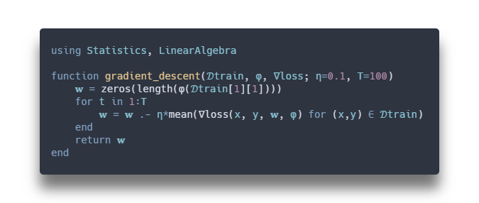</a></p>


## Stochastic gradient descent
Percy Liang and Dorsa Sadigh, *Artificial Intelligence: Principles and Techniques*, Stanford University, 2019.
<p align="center"><a href="./src/stochastic_gradient_descent.jl"> </a></p>


## Two-layer neural network
<p align="center"><a href="./src/neural_network.jl"> 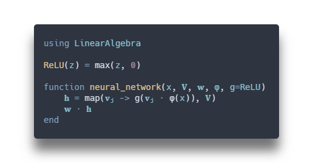</a></p>

##### Two-layer neural network (one-liner)
<p align="center"><a href="./src/neural_network_one_liner.jl"> 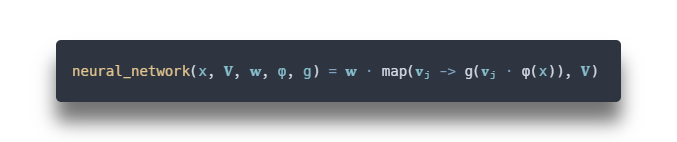</a></p>


## Multi-layer neural network
<p align="center"><a href="./src/multi_layer_neural_network.jl"> 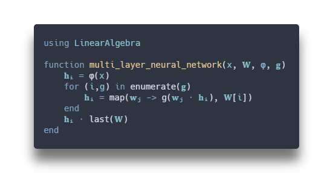</a></p>


## Loss functions
<p align="center"><a href="./src/loss_functions.jl"> 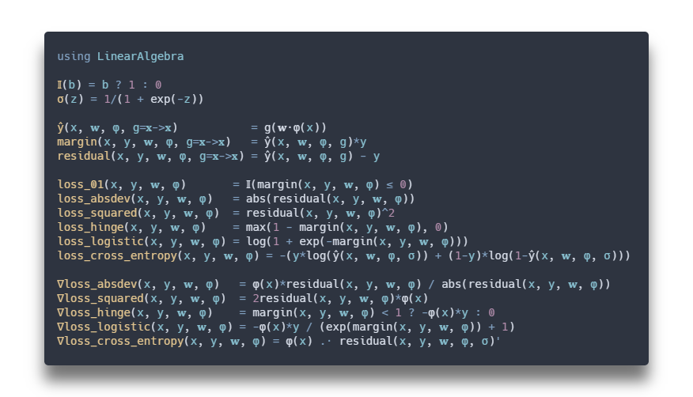</a></p>


## Distance functions
<p align="center"><a href="./src/distance_functions.jl"> 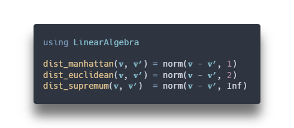</a></p>


## Nearest neighbor
<p align="center"><a href="./src/nearest_neighbor.jl"> 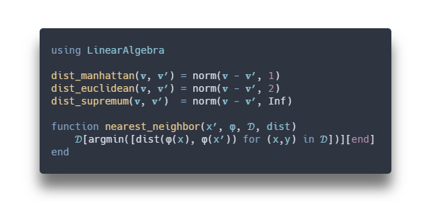</a></p>


## K-nearest neighbors
<p align="center"><a href="./src/k_nearest_neighbors.jl"> 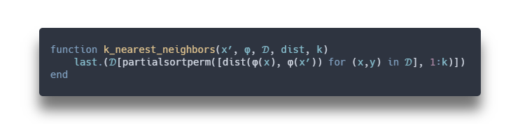</a></p>


## K-means clustering
Percy Liang and Dorsa Sadigh, *Artificial Intelligence: Principles and Techniques*, Stanford University, 2019.
<p align="center"><a href="./src/k_means_clustering.jl"> 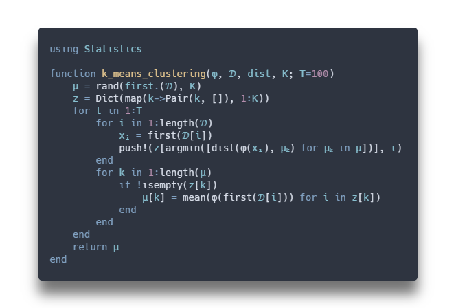</a></p>


## The EM algorithm
Andrew Ng, *Mixtures of Gaussians and the EM algorithm*, Stanford University, 2020.<sup><a href="http://cs229.stanford.edu/notes2020spring/cs229-notes7b.pdf">1</a></sup>
<p align="center"><a href="./src/em_algorithm.jl"> 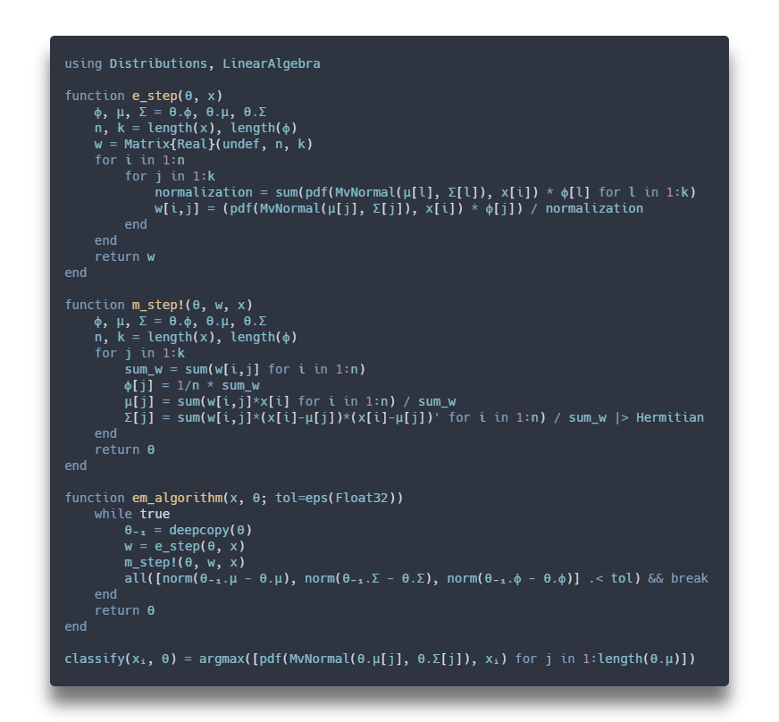</a></p>


## Linear regression
Mykel J. Kochenderfer and Tim A. Wheeler, *Algorithms for Optimization*, MIT Press, 2019.
<p align="center"><a href="./src/linear_regression.jl"> 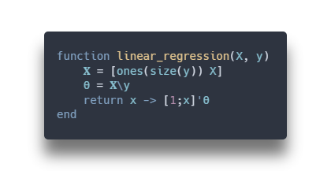</a></p>


## Ridge regression
<p align="center"><a href="./src/ridge_regression.jl"> 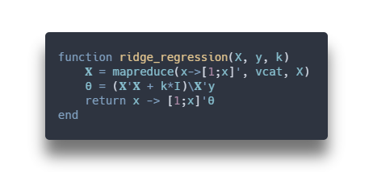</a></p>


## Basis regression
Mykel J. Kochenderfer and Tim A. Wheeler, *Algorithms for Optimization*, MIT Press, 2019.
<p align="center"><a href="./src/basis_regression.jl"> 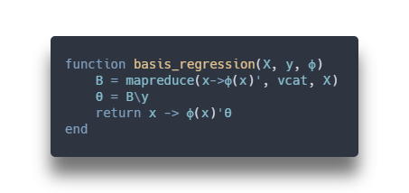</a></p>


## Radial basis regression
Mykel J. Kochenderfer and Tim A. Wheeler, *Algorithms for Optimization*, MIT Press, 2019.
<p align="center"><a href="./src/radial_basis_regression.jl"> 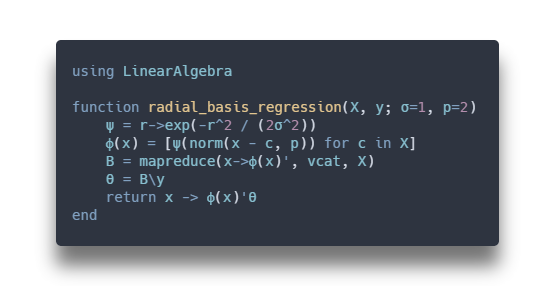</a></p>


## Cross-entropy method
Mykel J. Kochenderfer and Tim A. Wheeler, *Algorithms for Optimization*, MIT Press, 2019.
<p align="center"><a href="./src/cross_entropy_method.jl"> 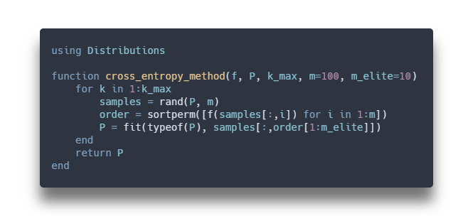</a></p>


## Finite difference methods
Mykel J. Kochenderfer and Tim A. Wheeler, *Algorithms for Optimization*, MIT Press, 2019.
<p align="center"><a href="./src/finite_difference_methods.jl"> 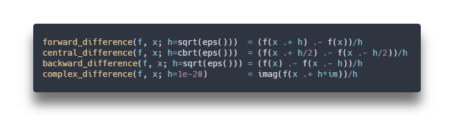</a></p>


## Simulated annealing
Mykel J. Kochenderfer and Tim A. Wheeler, *Algorithms for Optimization*, MIT Press, 2019.
<p align="center"><a href="./src/simulated_annealing.jl"> 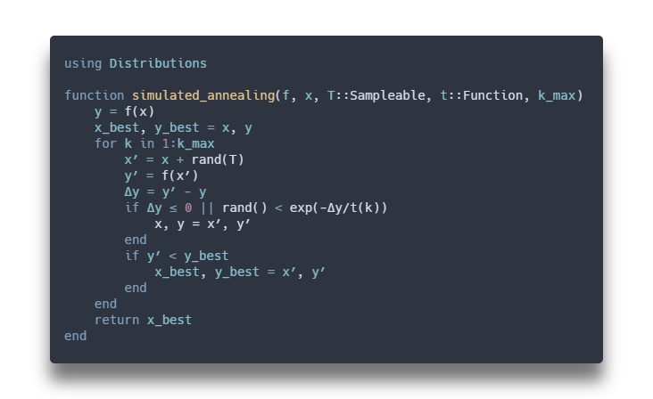</a></p>


## Twiddle
Sebatian Thurn, *Artificial Intelligence for Robotics*, Udacity, 2012.
<p align="center"><a href="./src/twiddle.jl"> 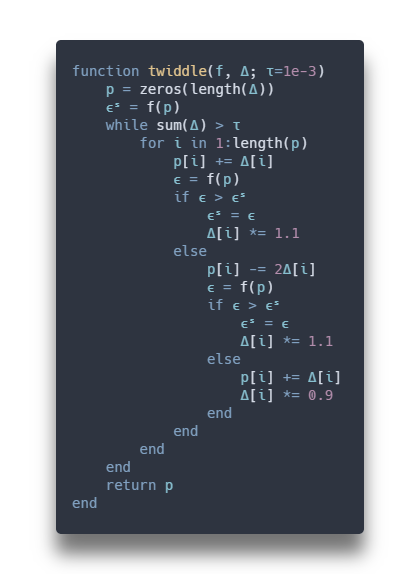</a></p>


## Newton's method
John Wallis, *A Treatise of Algebra both Historical and Practical*, 1685.
<p align="center"><a href="./src/newtons_method.jl"> 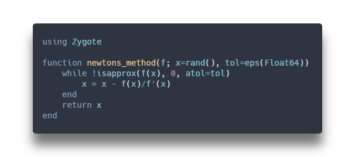</a></p>


## Gaussian process
Mykel J. Kochenderfer and Tim A. Wheeler, *Algorithms for Optimization*, MIT Press, 2019.
<p align="center"><a href="./src/gaussian_process.jl"> 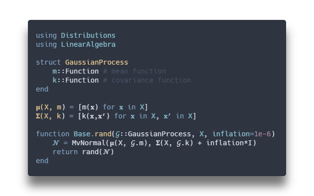</a></p>


## Gaussian process kernels
<p align="center"><a href="./src/gaussian_process_kernels.jl"> 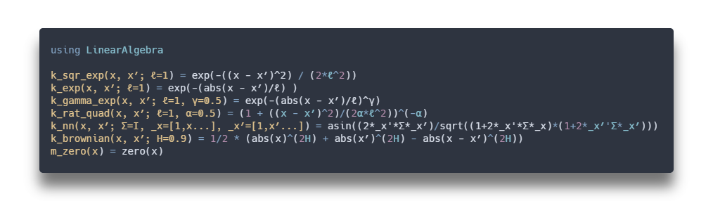</a></p>


## Thompson sampling
Daniel J. Russo, Benjamin Van Roy, Abbas Kazerouni, Ian Osband, and Zheng Wen, *A Tutorial on Thompson Sampling*, arXiv:1707.02038, 2020.
<p align="center"><a href="./src/thompson_sampling.jl"> 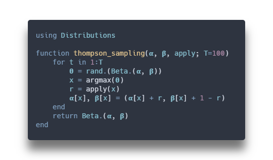</a></p>


## Particle filter
Mykel J. Kochenderfer, Tim A. Wheeler, and Kyle H. Wray, *Algorithms for Decision Making*, Preprint.
<p align="center"><a href="./src/particle_filter.jl"> 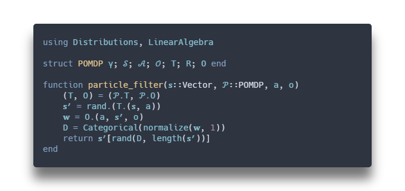</a></p>


## Value iteration
Mykel J. Kochenderfer, Tim A. Wheeler, and Kyle H. Wray, *Algorithms for Decision Making*, Preprint.
<p align="center"><a href="./src/value_iteration.jl"> 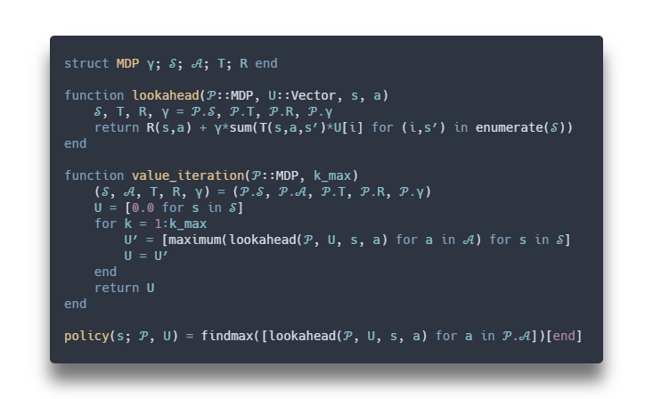</a></p>


## Branch and bound
Mykel J. Kochenderfer, Tim A. Wheeler, and Kyle H. Wray, *Algorithms for Decision Making*, Preprint.
<p align="center"><a href="./src/branch_and_bound.jl"> 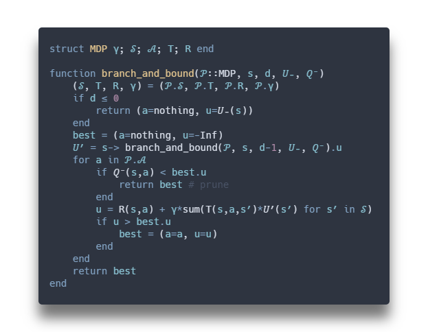</a></p>


## Monte Carlo tree search
Mykel J. Kochenderfer, Tim A. Wheeler, and Kyle H. Wray, *Algorithms for Decision Making*, Preprint.
<p align="center"><a href="./src/monte_carlo_tree_search.jl"> 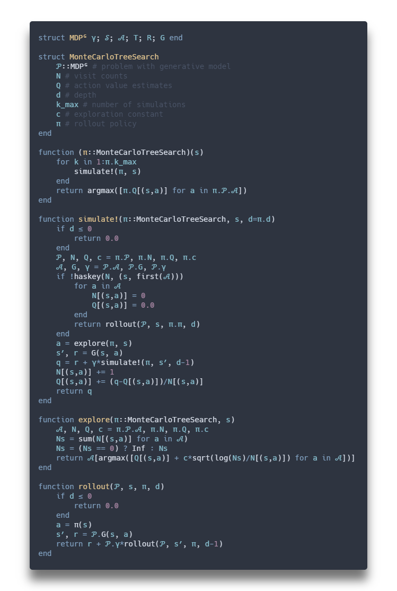</a></p>


## Huffman coding
David A. Huffman, *A Method for the Construction of Minimum-Redundancy Codes*, IEEE, 1952.
<p align="center"><a href="./src/huffman_coding.jl"> 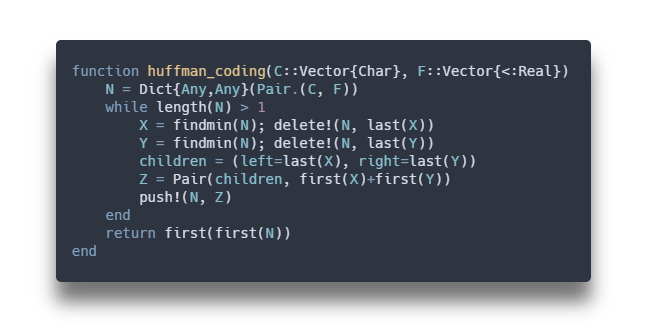</a></p>


## Hailstone sequence (Collatz conjecture)
<p align="center"><a href="./src/hailstone.jl"> 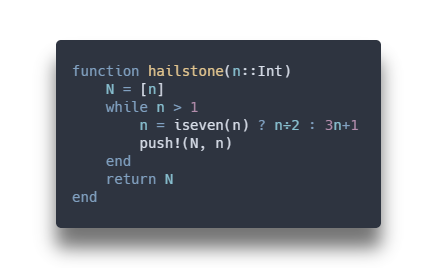</a></p>


## Bubble sort
Karey Shi, *Design and Analysis of Algorithms*, Stanford University, 2020.
<p align="center"><a href="./src/bubble_sort!.jl"> 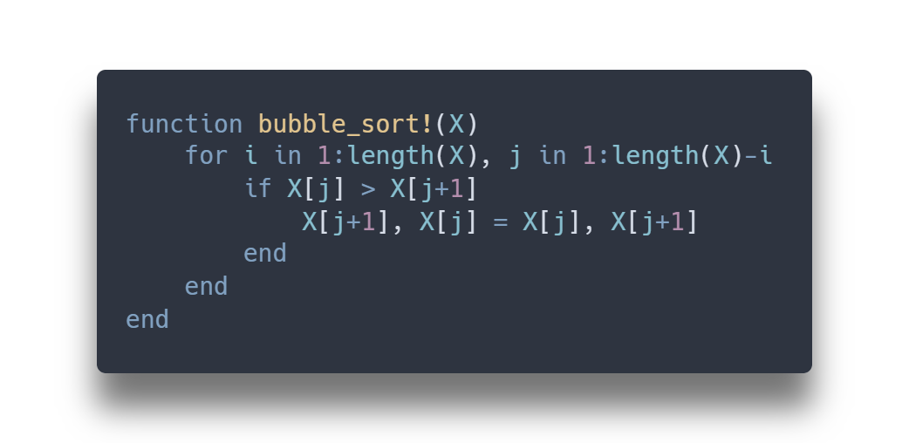</a></p>


## Merge sort
Karey Shi, *Design and Analysis of Algorithms*, Stanford University, 2020.
<p align="center"><a href="./src/merge_sort.jl"> 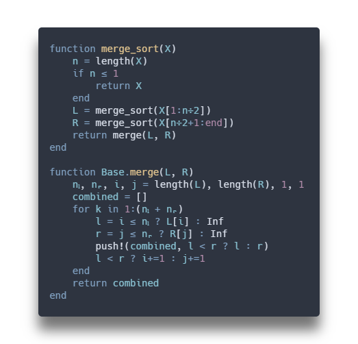</a></p>


## Insertion sort
Karey Shi, *Design and Analysis of Algorithms*, Stanford University, 2020.
<p align="center"><a href="./src/insertion_sort!.jl"> 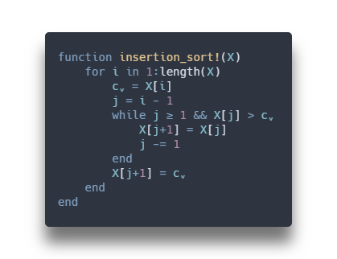</a></p>


## Bogo sort
<p align="center"><a href="./src/bogo_sort!.jl"> 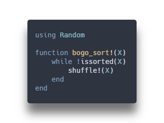</a></p>

##### Bogo sort (one-liner)
<p align="center"><a href="./src/bogo_sort!_one_liner.jl"> </a></p>


## Quine
Nathan Daly, *Julia Discord*, 2019.<sup><a href="https://discourse.julialang.org/t/quines-and-loons-self-replicating-programs/12607/7" target="_blank">2</a></sup>
<p align="center"><a href="./src/quine.jl"> 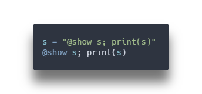</a></p>

---

Written by [Robert Moss](https://github.com/mossr).
